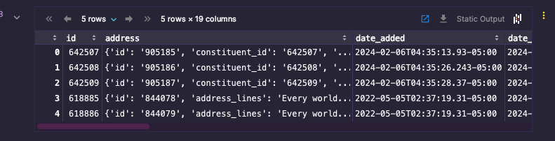
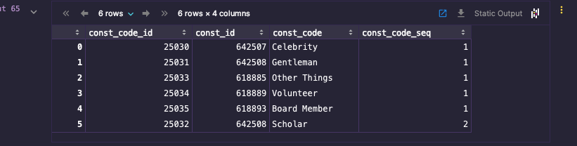

## Use data from AWS S3 for SKY API Calls

This walkthrough uses Python to accomplish the following:
1. Authenticate into an existing AWS S3 bucket
2. Extract data from an existing JSON file containing Constituent data
3. Use the extracted data to make individual API calls to the SKY API
4. Join all of the data gathered into one new JSON file containing Constituent Codes
5. Merge the two JSON files into a new third file with all original Constituent data and Constituent Codes

### Get an existing file from S3
I created an AWS S3 bucket and loaded some dummy constituent data from the Blackbaud RE NXT development environment. 
This data is stored in a JSON file format and is an extract of the GET Constituent List SKY API endpoint.

```python
import json
import boto3

# Define a function to retrieve JSON content from an S3 bucket
def retrieve_json_from_s3(bucket_name, json_file_name):
 
    # Create a session using your AWS credentials
    session = boto3.Session(
        aws_access_key_id="key_id",
        aws_secret_access_key="access_key",
        region_name="region"
    )
    # Create an S3 client
    s3 = session.client("s3")

    # Retrieve JSON file content from S3
    file_content = s3.get_object(Bucket=bucket_name, Key=json_file_name)['Body'].read().decode('utf-8')

    # Parses JSON content
    data = json.loads(file_content)

    return data

results = retrieve_json_from_s3("blackbaud-testing", "test-constituents.json")
```

Below is a small extract of the data that is returned in the `results` variable. We'll need the `id` field from each item in the list (array) to make calls to the SKY API. 
```json
[{
        "id": "642507",
        "address": {
            "id": "905185",
            "constituent_id": "642507",
            "do_not_mail": false,
            "formatted_address": "\r\n,   ",
            "inactive": false,
            "preferred": true,
            "type": "Home"
        },
        "date_added": "2024-02-06T04:35:13.93-05:00",
        "date_modified": "2024-02-07T07:08:34.69-05:00",
        "deceased": false,
        "fundraiser_status": "None",
        "gender": "Unknown",
        "gives_anonymously": false,
        "inactive": false,
        "last": " Last name ",
        "lookup_id": "13298",
        "name": "Last name",
        "spouse": {
            "is_head_of_household": false
        },
        "type": "Individual"
    }, {
        "id": "642508",
        "address": {
            "id": "905186",
            "constituent_id": "642508",
            "do_not_mail": false,
            "formatted_address": "\r\n,   ",
            "inactive": false,
            "preferred": true,
            "type": "Home"
        },
        "date_added": "2024-02-06T04:35:26.243-05:00",
        "date_modified": "2024-02-07T07:08:34.69-05:00",
        "deceased": false,
        "fundraiser_status": "None",
        "gender": "Unknown",
        "gives_anonymously": false,
        "inactive": false,
        "last": " Last name ",
        "lookup_id": "13299",
        "name": "Last name",
        "spouse": {
            "is_head_of_household": false
        },
        "type": "Individual"
    }]
```

Next, extract the `id` from each item and store into a new list.
```python
user_id = [ index['id'] for index in results ]
```

This will return the following: \n 

['642507', '642508', '642509', '618885', '618886', '618887', '618888', '618889', '618890', '618891', '618892', '618893', '618992', '618993', '618994', '618995', '618996', '618997', '618998', '618999', '619000', '628940', '628941', '628942', '628943', '628944', '628945', '628946', '628947', '628948', '628949', '628950', '628951', '628952', '628953', '628954', '628955', '628956', '628957', '628958', '628959', '628960', '628961', '628962', '628963', '628964', '628965', '628966', '628967', '628968', '628969', '628970', '628971', '628972', '628973', '628974', '628975']

### Get an access token for the SKY API
The SKY API requires an access token to make calls. This token is obtained by making a POST request to the SKY API's token endpoint. 
```python

import requests
from urllib.parse import urlencode

# Replace the following values with your actual API credentials
client_id = '7b1f9c28-90d9-49ee-a3a4-12c3db01ded5'
client_secret = 'f2NII6IiHbghiB2ssxZ/q+mswVLjksAmSlrjMvUQbsE=' #OAuth Client Secret
redirect_uri = 'https://www.matt-thacker.com/redirect'
scope = 'Full'

# Step 1: Get the authorization URL
authorization_url = 'https://oauth2.sky.blackbaud.com/authorization'
params = {
	'response_type': 'code',
	'client_id': client_id,
	'redirect_uri': redirect_uri,
	'scope': scope
}
url = f'{authorization_url}?{urlencode(params)}'

print(f'Please visit the following URL to authorize the application:\n{url}')

```

After visiting the URL and authorizing the application, the user will be redirected to the `redirect_uri` with a `code` parameter in the URL. This code is used to obtain an access token. 
```python
# Step 2: Get the authorization code from the user
auth_code = input('Enter the authorization code you received: ')
```

The `auth_code` is then used to obtain an access token.
```python
# Step 3: Exchange the authorization code for an access token
token_url = 'https://oauth2.sky.blackbaud.com/token'
payload = {
	'grant_type': 'authorization_code',
	'code': auth_code,
	'client_id': client_id,
	'client_secret': client_secret,
	'redirect_uri': redirect_uri
}
response = requests.post(token_url, data=payload)
response_data = response.json()

if 'access_token' not in response_data:
	print(f'Error: {response_data.get("error_description")}')
else:
	access_token = response_data['access_token']
	refresh_token = response_data['refresh_token']
	print(f'Access token: {access_token}\nRefresh token: {refresh_token}')
```

This function will return a a variable `access_token` which is used to make calls to the SKY API and will look like:
```text
Access token: eyJhbGciOiJSUzI1NiIsImtpZCI6IjREVjZzVkxIM0FtU1JTbUZqMk04Wm5wWHU3WSIsInR5cCI6IkpXVCJ9.eyJhcHBsaWNhdGlvbmlkIjoiN2IxZjljMjgtOTBkOS00OWVlLWEzYTQtMTJjM2RiMDFkZWQ1IiwiZW52aXJvbm1lbnRpZCI6InAtdm5WQWJEdGZ1MEd5TXFTRG1HLV9xdyIsImVudmlyb25tZW50bmFtZSI6IlNLWSBEZXZlbG9wZXIgQ29ob3J0IEVudmlyb25tZW50IDEiLCJsZWdhbGVudGl0eWlkIjoicC1nVnFyX3lPU2tVcXNFS3RtLVpwSm5BIiwibGVnYWxlbnRpdHluYW1lIjoiU0tZIERldmVsb3BlciBDb2hvcnQiLCJtb2RlIjoiRnVsbCIsInpvbmUiOiJwLXVzYTAxIiwibmFtZWlkIjoiZDliZTZlY2YtOGFiNC00YjUxLThhYWMtZjNiYjQwOGE0NGNhIiwianRpIjoiYmM4ZWM3YjQtYWQzMi00NmZjLWE3ODktMWM2NjRiMDcyNDI4IiwiZXhwIjoxNzA5NzkxNDcyLCJpYXQiOjE3MDk3ODc4NzIsImlzcyI6Imh0dHBzOi8vb2F1dGgyLnNreS5ibGFja2JhdWQuY29tLyIsImF1ZCI6ImJsYWNrYmF1ZCJ9.cvf89kCkJQ2yzrBvvWEuU4YqDwZ4o-KGoFP5hq4sSK7s0OdGBrpMd4GF1eH146azUAqUhDTtBfJmG8l23ptgCPm6WSg8GxTondyqNXsLjgvU6CKv7k6lrzaW4AHnU3IJ-_BmtOpjLE2cxR7n3XgnK3p4UeSYtdiOM7-bBZNV4RHILTpV_DxeGJaVOIxhzCt4rk_vyk3zBPmIsnC2l8MZ-0LpnI_IyQATOlgQbWl7wPA9y_LP6bBoWlAtdXcfkP_GI-owWvtHdPNiqBOZzbikjAvdGLnj7AK_75QbTexDQuXcrLo2aTFmxKOuXrqZh2S76l2Z3KYdyNWnjAcORvP3og
```

### Make a call to the SKY API

Construct a function to make a call to the SKY API using the `access_token` and the `id` from the `user_id` list we created earlier. 

```python
def get_constituent_code_by_id(constituent_id):
    # Define the endpoint
    endpoint = f"https://api.sky.blackbaud.com/constituent/v1/constituents/{constituent_id}/constituentcodes"

    # Define the headers
    headers = {
        "Authorization": f"Bearer {access_token}",
        "Bb-Api-Subscription-Key": '2ea374f2e6234d8a9cd2ed724587fe31',
        "Content-Type": "application/json"
    }

    # Send the request
    response = requests.get(endpoint, headers=headers)

    # Check if the request was successful
    if response.status_code == 200:
        ids_with_codes.append(response.json())
        return response.json()
    else:
        # Handle error scenarios
        raise Exception(f"Failed to get constituent by ID: {response.text}")

ids_with_codes = []

for id in user_id:
    try:
        get_constituent_code_by_id(id)
    except Exception as e:
        print(e)
```

Write the data to a new JSON file.
```python
with open('constituent_codes.json', 'w') as f:
    json.dump(ids_with_codes, f)
```
### Create a Pandas dataframe from original Constituent data
```python
import pandas as pd

df_constituents = pd.DataFrame(results)


```



```python

### Clean the list of Constituent Codes to flatten the data using pandas

```python
df_constitiuent_codes = pd.DataFrame(constituent_codes_clean, columns=['constituent_codes1', 'constituent_codes2'])

col1 = df_constitiuent_codes['constituent_codes1'].to_frame()
col2 = df_constitiuent_codes['constituent_codes2'].to_frame()

col1.dropna(inplace=True)
col2.dropna(inplace=True)

col1.rename(columns={'constituent_codes1':'constituent_codes'}, inplace=True)
col2.rename(columns={'constituent_codes2':'constituent_codes'}, inplace=True)

new_df = pd.concat([col1, col2]).reset_index(drop=True)

new_df.explode('constituent_codes')


def explode(vect):
    const_code_id = vect['id']
    const_id = vect['constituent_id']
    const_code = vect['description']
    const_code_seq = vect['sequence']
    
    return const_code_id, const_id, const_code, const_code_seq

new_df['const_code_id'], new_df['const_id'], new_df['const_code'], new_df['const_code_seq'] = zip(*new_df['constituent_codes'].map(explode))

new_df.drop(columns=['constituent_codes'], inplace=True)
```


### Merge the two dataframes
```python
df_merged = pd.merge(df_constituents, new_df, left_on='id', right_on='const_id', how='left')
```

